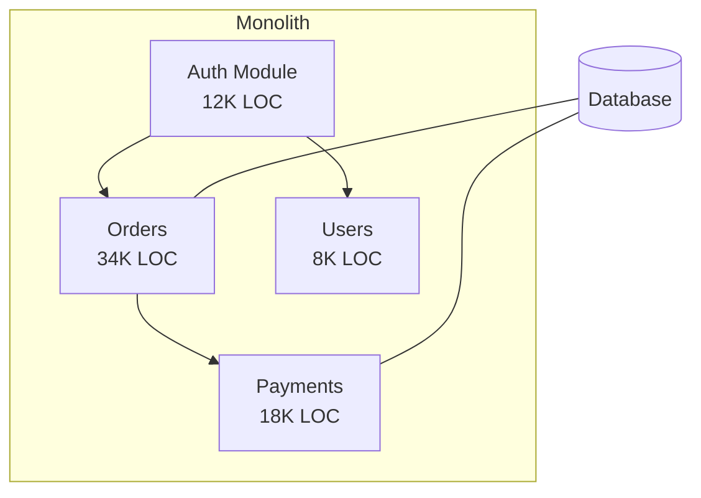

# Refactorizer

**Data-driven monolith decomposition skills for [Claude Code](https://claude.ai/claude-code).**

Analyze any codebase — identify hotspots, hidden coupling, ownership risks — and get a prioritized decomposition plan with 5 strategic options, architecture diagrams, and an execution roadmap.

```
┌──────────────────────────────────────────────────────────────┐
│                                                              │
│   /refactorize                                               │
│                                                              │
│   Stage 1: Business Context & Census ──── Architecture       │
│        ↓                                    Diagram          │
│   Stage 2: Hotspot Analysis ───────────── Heatmap            │
│        ↓                                                     │
│   Stage 3: Coupling & Dependencies ────── Dependency Map     │
│        ↓                                                     │
│   Stage 4: Social & Ownership Analysis ── Ownership Map      │
│        ↓                                                     │
│   Stage 5: 5 Decomposition Options ────── Comparison Matrix  │
│        ↓                                                     │
│   Stage 6: Execution Roadmap ──────────── Gantt Chart        │
│                                                              │
│   Each stage has an Architect Review Gate                     │
│                                                              │
└──────────────────────────────────────────────────────────────┘
```

## Quick Start

### 1. Install

Copy or symlink the `.claude/commands/` directory into your project:

```bash
# Option A: Clone and symlink
git clone https://github.com/YOUR_USER/refactorizer.git ~/tools/refactorizer
ln -s ~/tools/refactorizer/.claude/commands/refactorize.md YOUR_PROJECT/.claude/commands/refactorize.md
ln -s ~/tools/refactorizer/.claude/commands/refactorize-hotspots.md YOUR_PROJECT/.claude/commands/refactorize-hotspots.md
ln -s ~/tools/refactorizer/.claude/commands/refactorize-coupling.md YOUR_PROJECT/.claude/commands/refactorize-coupling.md

# Option B: Copy directly
mkdir -p YOUR_PROJECT/.claude/commands
cp ~/tools/refactorizer/.claude/commands/refactorize*.md YOUR_PROJECT/.claude/commands/
```

### 2. Run

Open Claude Code in your project directory and use the slash commands:

```bash
# Full decomposition analysis (start here)
/refactorize

# Focus on a specific area
/refactorize payments module

# Deep-dive into a specific hotspot file
/refactorize-hotspots src/services/order_processor.py

# Analyze coupling between two modules
/refactorize-coupling src/auth src/users
```

## What You Get

### Stage 1: Business Context & Codebase Census

Maps the current architecture and establishes business context (pain points, team structure, deployment frequency). Outputs an **architecture overview diagram**.



### Stage 2: Hotspot Analysis

Finds the 2-5% of files consuming most development effort (Tornhill method: change frequency × complexity). Outputs a **hotspot heatmap**.

| File | Commits | LOC | Score | Business Impact |
|------|---------|-----|-------|-----------------|
| order_processor.py | 142 | 2,340 | 🔴 CRITICAL | Blocks every release |
| payment_service.ts | 98 | 1,870 | 🔴 CRITICAL | 3 production incidents |
| user_controller.java | 67 | 1,200 | 🟠 HIGH | Merge conflicts daily |

### Stage 3: Coupling & Dependencies

Discovers hidden dependencies through change coupling analysis (files that change together in git) and static import analysis. Outputs a **dependency map** with violations highlighted.

### Stage 4: Social & Ownership Analysis

Maps code ownership, bus factor, and Conway's Law alignment. Outputs an **ownership risk map** identifying key-person risks and contested modules.

### Stage 5: Five Decomposition Options

Presents 5 strategic options with architecture diagrams, pros/cons, effort estimates, and a comparison matrix:

| Option | Strategy | Risk | Effort | First Value |
|--------|----------|------|--------|-------------|
| 1 | Modular Monolith | 🟢 Low | 2-4 weeks | 1-2 weeks |
| 2 | Strangler Fig (single module) | 🟡 Med | 2-3 months | 4-6 weeks |
| 3 | DDD Bounded Contexts | 🟡 Med | 4-6 months | 8-12 weeks |
| 4 | Event-Driven Decoupling | 🟠 High | 4-8 months | 6-10 weeks |
| 5 | Full Microservices | 🔴 V.High | 6-12 months | 12-16 weeks |

### Stage 6: Execution Roadmap

For the selected option: extraction sequence, per-module plans with seams and dependency breaks, milestone Gantt chart, and metrics dashboard.

## The Three Skills

### `/refactorize` — Full Pipeline
The main skill. Runs all 6 stages with architect review gates between each. Use this to start any decomposition initiative.

### `/refactorize-hotspots <file>` — Hotspot Deep-Dive
Drills into a single hotspot file to find function-level hotspots, responsibility clusters, and extraction opportunities. Includes before/after diagrams and pros/cons for each extraction.

### `/refactorize-coupling <module1> [module2]` — Coupling Analysis
Analyzes coupling between two modules (or within a single module). Presents 3 decoupling strategies with diagrams, pros/cons, and a recommendation.

## Methodology

Built on proven techniques from the leading practitioners:

| Expert | Contribution | Applied In |
|--------|-------------|-----------|
| **Adam Tornhill** | Behavioral code analysis, hotspots, change coupling, code health | Stages 2-4 |
| **Michael Feathers** | Seam identification, characterization tests, dependency breaking | Stage 6 |
| **Sam Newman** | Strangler Fig, Branch by Abstraction, migration patterns | Stage 5-6 |
| **Eric Evans** | Bounded contexts, ubiquitous language, domain-driven design | Stage 5 |
| **Maude Lemaire** | Refactoring at scale, milestone planning, 80/20 principle | Stage 6 |
| **Google LSC** | Large-scale automated changes, static analysis gates | Stage 6 |

Key references:
- *Software Design X-Rays* — Adam Tornhill (2018)
- *Working Effectively with Legacy Code* — Michael Feathers (2004)
- *Monolith to Microservices* — Sam Newman (2019)
- *Domain-Driven Design* — Eric Evans (2003)
- *Refactoring at Scale* — Maude Lemaire (2020)
- Google SWE Book, Ch. 22: Large-Scale Changes (2020)

## Requirements

- **Claude Code** — [install](https://claude.ai/claude-code)
- **Git repository** with 6+ months of history (for behavioral analysis). The skill falls back to static analysis only if git is unavailable, with reduced confidence noted.
- **Python 3** — for change coupling analysis scripts (inline, no packages needed)
- **`cloc`** — recommended for accurate LOC counting (falls back to `wc -l`)

## How It Works

The skill uses your codebase's own data — git history, file structure, import graph — to make evidence-based decomposition recommendations. No external services, no data leaves your machine.

```
Your Codebase ──→ Git History Mining ──→ Hotspots
    │                                      │
    ├──→ Static Import Analysis ──→ Coupling Map
    │                                      │
    ├──→ Git Author Analysis ──→ Ownership Map
    │                                      │
    └──→ File Metadata ──→ Code Age ──→ Decomposition
                                         Options
                                           │
                                           ↓
                                    Architect Review
                                    & Execution Plan
```

## FAQ

**Q: How large a codebase can this handle?**
A: Tested on codebases up to 2M+ LOC. Git history mining is the bottleneck — for very large repos, the `--since` flag limits the analysis window. You can adjust this by passing a time range.

**Q: Does it work without git history?**
A: Yes, but with reduced confidence. Stages 2-4 (hotspots, coupling, ownership) rely on git data. Without it, the skill falls back to static analysis (import graph, file sizes, directory structure) and clearly notes the limitation.

**Q: What languages are supported?**
A: Language-agnostic for git-based analysis (hotspots, coupling, ownership). Static import analysis supports Python, JavaScript/TypeScript, Java, Go, Rust, C/C++, PHP, Ruby, C#. The skill auto-detects the primary language.

**Q: Can I run this on a monorepo?**
A: Yes. Pass a subdirectory as the argument to scope the analysis: `/refactorize src/backend`

**Q: Does any data leave my machine?**
A: No. All analysis runs locally using git commands, file system operations, and inline Python scripts. Nothing is sent to external services.

## Contributing

Contributions welcome! See [CONTRIBUTING.md](CONTRIBUTING.md).

## License

MIT — see [LICENSE](LICENSE).
