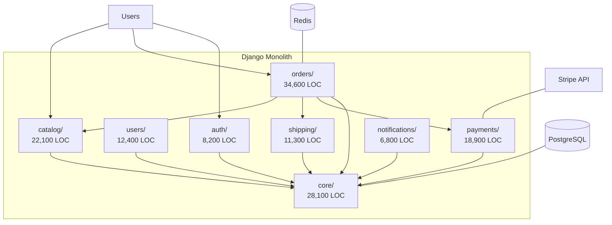
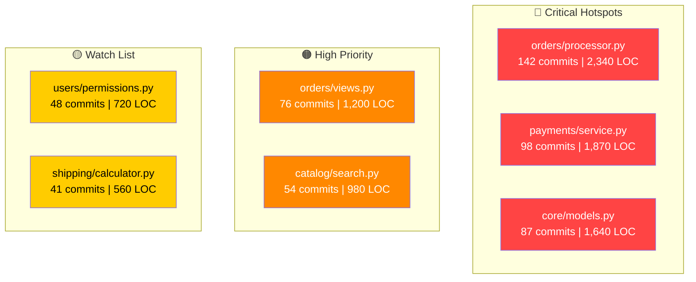
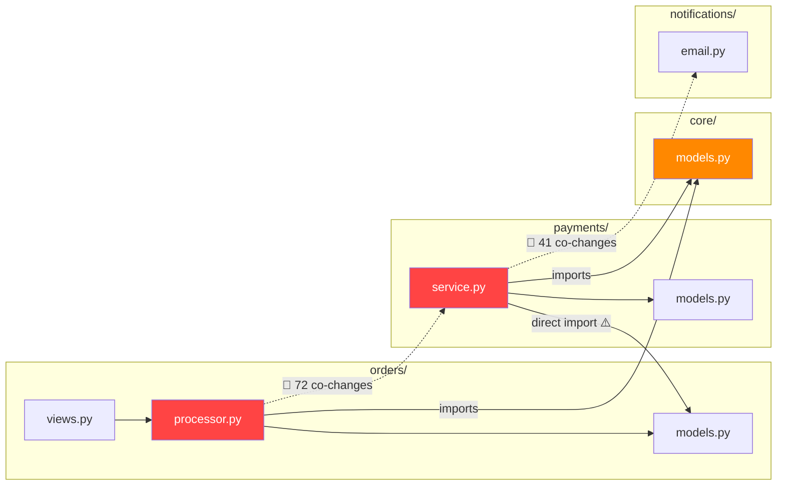

# Example Output: /refactorize on a Django E-Commerce Monolith

> This is a representative example of what `/refactorize` produces when run against a ~200K LOC Django monolith.

---

## STAGE 1: BUSINESS CONTEXT & CODEBASE CENSUS

### Business Context
- **Pain points**: Releases take 2 weeks, payment bugs affect all modules, 3 teams blocked by shared `core/` module
- **Teams**: 3 (Platform, Payments, Growth)
- **Deploy frequency**: Bi-weekly
- **Lead time**: ~10 days

### Codebase Profile
- **Total LOC**: 187,432 (Python: 142K, JavaScript: 38K, HTML: 7K)
- **Top-level modules**: 12 directories
- **Build system**: Django, pip, webpack
- **Architecture**: Layered monolith trending toward ball-of-mud

### Architecture Overview



### Stage Gate 1

```
╔══════════════════════════════════════════════════════════════╗
║  STAGE GATE 1: CODEBASE CENSUS COMPLETE                     ║
╠══════════════════════════════════════════════════════════════╣
║                                                              ║
║  Total LOC:        187,432                                   ║
║  Languages:        Python (76%), JavaScript (20%), HTML (4%) ║
║  Top-level modules: 12                                       ║
║  Build system:     Django + webpack                          ║
║  Architecture:     Layered monolith (ball-of-mud tendencies) ║
║                                                              ║
║  Business context:                                           ║
║  • Pain points:    Slow releases, payment bugs cascade,      ║
║                    teams blocked by shared core               ║
║  • Teams:          3 (Platform, Payments, Growth)            ║
║  • Deploy freq:    Bi-weekly                                 ║
║                                                              ║
╚══════════════════════════════════════════════════════════════╝
```

---

## STAGE 2: HOTSPOT ANALYSIS

| # | File | Commits (12mo) | LOC | Score | Business Impact |
|---|------|----------------|-----|-------|-----------------|
| 1 | orders/processor.py | 142 | 2,340 | 🔴 CRITICAL | Blocks every sprint |
| 2 | payments/service.py | 98 | 1,870 | 🔴 CRITICAL | 3 prod incidents in 6mo |
| 3 | core/models.py | 87 | 1,640 | 🔴 CRITICAL | All 3 teams conflict here |
| 4 | orders/views.py | 76 | 1,200 | 🟠 HIGH | Merge conflicts weekly |
| 5 | catalog/search.py | 54 | 980 | 🟠 HIGH | Performance bottleneck |
| 6 | users/permissions.py | 48 | 720 | 🟡 MEDIUM | Growing complexity |
| 7 | shipping/calculator.py | 41 | 560 | 🟡 MEDIUM | New carrier integration |

### Hotspot Heatmap



**Key finding**: 3 files (1.6% of codebase) account for 38% of all commits. Every team touches `core/models.py` — this is your primary bottleneck.

---

## STAGE 3: COUPLING & DEPENDENCY ANALYSIS

### Unexpected Coupling Pairs

| Co-changes | File A | File B | Expected? |
|-----------|--------|--------|-----------|
| 72 | orders/processor.py | payments/service.py | 🔴 No — should be independent |
| 54 | core/models.py | orders/views.py | 🟡 Partially — shared models |
| 41 | payments/service.py | notifications/email.py | 🔴 No — payment shouldn't know about email |
| 38 | catalog/search.py | orders/processor.py | 🔴 No — search and orders are separate domains |

### Dependency Map



**Circular dependency found**: `payments/service.py` imports `orders/models.py` AND `orders/processor.py` imports `payments/service.py`. This circular dependency makes independent deployment impossible.

---

## STAGE 5: FIVE DECOMPOSITION OPTIONS

### Options Comparison

| Criteria | Opt 1: Modular | Opt 2: Strangler | Opt 3: DDD | Opt 4: Events | Opt 5: Full |
|----------|---------------|-----------------|------------|---------------|-------------|
| Risk | 🟢 Low | 🟡 Med | 🟡 Med | 🟠 High | 🔴 V.High |
| Effort | 2-4 weeks | 2-3 months | 4-6 months | 4-8 months | 6-12 months |
| Team autonomy | Partial | Partial | High | High | Full |
| Deploy independence | No | Partial | Yes | Yes | Yes |
| Infra complexity | None | Low | Medium | Medium | High |
| Reversibility | Easy | Easy | Medium | Medium | Hard |
| First value | 1-2 weeks | 4-6 weeks | 8-12 weeks | 6-10 weeks | 12-16 weeks |

### Recommended Approach

**Primary: Option 3 — DDD Bounded Contexts**

Rationale: With 3 teams already aligned to business domains (Platform, Payments, Growth), bounded context extraction directly addresses the core pain: teams blocking each other in shared code. The data confirms natural domain boundaries — orders, payments, and catalog have distinct ownership patterns. The circular dependency between orders↔payments is the critical blocker to resolve first.

**Fallback: Option 2 — Strangler Fig (Payments first)**

Rationale: If full DDD extraction proves too ambitious, extracting payments alone (the module with the most production incidents) delivers 60% of the reliability benefit at 30% of the cost.

---

*This is a truncated example. The full output includes Stages 4 and 6 with ownership maps, execution roadmap, Gantt chart, and metrics dashboard.*
